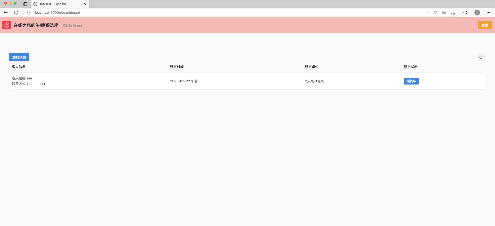

# reservation-sys

一个基于Node.js的全栈应用程序，使用TypeScript编写。它提供了餐厅预约订座的功能，客户和员工都可以通过账号登录系统，客户还可以注册账号。客户可以添加预约，包括时间、预定桌子可做人数等信息，系统会根据这些信息自动分配一个可用的桌子。客户可以取消自己提交的预约，员工可以查看并取消所有预约。


## 技术栈

* 后端框架: [LoopBack 4](https://loopback.io/doc/index.html)
* 数据库: MongoDB
* 认证方式: JWT
* 前端框架: [Vue3](https://vuejs.org) + [NaiveUI](https://www.naiveui.com)

## 安装

1. 克隆代码到本地

``` sh
git clone https://github.com/{YOUR_GITHUB_USERNAME}/reservation-sys.git
```

2. 进入项目根目录，安装依赖

``` sh
cd reservation-sys
npm i

# 前端
cd frontend
npm i
```

## 运行 (dev)

1. 启动MongoDB
```sh
# Windows
docker run -d -p 27017:27017 mongo

# MacOS/Linux
sudo docker run -d -p 27017:27017 mongo
```
2. 启动后端服务
```sh
npm start
# 监听端口 3000
# openapi: /explorer
```
3. 启动前端服务
```sh
npm run dev:frontend
# 监听端口 3001
```


## 部署

1. 构建 Docker 镜像
```sh
npm run docker:build
```
2. 启动
```sh
docker-compose up -d
```

## UI screenshots





